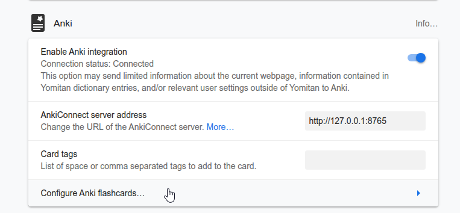

# Screenshotter

Screenshotter is an application which takes screenshots of a selected window and puts the image into the clipboard. You can set a frequency in seconds on how often a new screenshot of the window will be taken.


## Motivations

I made this app because I wanted a way to have images for my Anki Cards, without having to do additional work everytime I mine a card.


^ These these are my settings in [Yomitan](https://github.com/yomidevs/yomitan)



^ I added a second button, which uses the `clipboard-image` for screenshots instead of [Yomitan's](https://github.com/yomidevs/yomitan) `screenshot` feature.

## Development


To run dev mode
```
For Desktop development, run:
  deno task tauri dev
```

# Tauri + Vue + TypeScript

This template should help get you started developing with Vue 3 and TypeScript in Vite. The template uses Vue 3 `<script setup>` SFCs, check out the [script setup docs](https://v3.vuejs.org/api/sfc-script-setup.html#sfc-script-setup) to learn more.

## Recommended IDE Setup

- [VS Code](https://code.visualstudio.com/) + [Volar](https://marketplace.visualstudio.com/items?itemName=Vue.volar) + [Tauri](https://marketplace.visualstudio.com/items?itemName=tauri-apps.tauri-vscode) + [rust-analyzer](https://marketplace.visualstudio.com/items?itemName=rust-lang.rust-analyzer)

## Type Support For `.vue` Imports in TS

Since TypeScript cannot handle type information for `.vue` imports, they are shimmed to be a generic Vue component type by default. In most cases this is fine if you don't really care about component prop types outside of templates. However, if you wish to get actual prop types in `.vue` imports (for example to get props validation when using manual `h(...)` calls), you can enable Volar's Take Over mode by following these steps:

1. Run `Extensions: Show Built-in Extensions` from VS Code's command palette, look for `TypeScript and JavaScript Language Features`, then right click and select `Disable (Workspace)`. By default, Take Over mode will enable itself if the default TypeScript extension is disabled.
2. Reload the VS Code window by running `Developer: Reload Window` from the command palette.

You can learn more about Take Over mode [here](https://github.com/johnsoncodehk/volar/discussions/471).

Make sure you have installed the prerequisites for your OS: https://tauri.app/start/prerequisites/, then run:
  cd screenshotter
  deno install
  deno task tauri android init