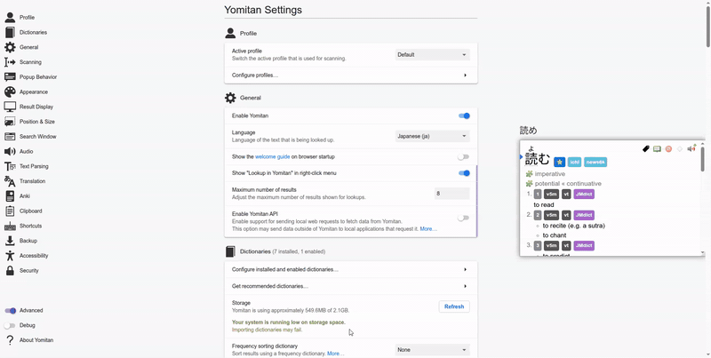

# Screenshotter

**Screenshotter** is a simple desktop application that continuously captures screenshots of a selected window and copies them directly to your clipboard.  
You can configure the capture frequency (in seconds), making it easy to keep your clipboard up to date with the latest screenshot.

👉 [Download the latest release here](https://github.com/KolbyML/screenshotter/releases)

---


## ✨ Motivation

I built Screenshotter to streamline my Anki workflow.  
When creating cards, I wanted a quick way to grab images without the extra hassle of manually taking and importing screenshots each time.

---

## 🚀 Getting Started

### 1. Download
Head over to the [Releases page](https://github.com/KolbyML/screenshotter/releases) and download the latest version for your OS:

- **Windows:** `Screenshotter-x.y.z-x64-setup.exe`
- **Linux:** `Screenshotter-x.y.z.AppImage`

---

### 2. Install & Run

**Windows**
1. Run the `.exe` installer and follow the prompts.
2. Launch *Screenshotter* from the Start Menu.
3. Select the window you want to capture and set your screenshot frequency.

**Linux**
1. Make the AppImage executable:
   ```bash
   chmod +x Screenshotter-x.y.z.AppImage
   ```

---

### 3. Yomitan Setup Guide
Here’s how it integrates with [Yomitan](https://github.com/yomidevs/yomitan):




#### 1. Open Yomitan's settings page

#### 2. Click on `Configure Anki flashcards` in the Anki section

#### 3. Copy the `{clipboard-image}` marker into the desired field


Finished! :D

### 4. Use with Anki

- Follow step 3 to set up Yomitan
- Let **Screenshotter** run in the background to keep your clipboard filled with fresh screenshots.
- When you press the button, Yomitan will grab the latest image directly from the clipboard and insert it into your Anki card.

---

## 🛠 Development

To run Screenshotter in development mode:

```bash
deno task tauri dev
```

## Tauri Setup stuff

### Tauri + Vue + TypeScript

This template should help get you started developing with Vue 3 and TypeScript in Vite. The template uses Vue 3 `<script setup>` SFCs, check out the [script setup docs](https://v3.vuejs.org/api/sfc-script-setup.html#sfc-script-setup) to learn more.

## Recommended IDE Setup

- [VS Code](https://code.visualstudio.com/) + [Volar](https://marketplace.visualstudio.com/items?itemName=Vue.volar) + [Tauri](https://marketplace.visualstudio.com/items?itemName=tauri-apps.tauri-vscode) + [rust-analyzer](https://marketplace.visualstudio.com/items?itemName=rust-lang.rust-analyzer)

### Type Support For `.vue` Imports in TS

Since TypeScript cannot handle type information for `.vue` imports, they are shimmed to be a generic Vue component type by default. In most cases this is fine if you don't really care about component prop types outside of templates. However, if you wish to get actual prop types in `.vue` imports (for example to get props validation when using manual `h(...)` calls), you can enable Volar's Take Over mode by following these steps:

1. Run `Extensions: Show Built-in Extensions` from VS Code's command palette, look for `TypeScript and JavaScript Language Features`, then right click and select `Disable (Workspace)`. By default, Take Over mode will enable itself if the default TypeScript extension is disabled.
2. Reload the VS Code window by running `Developer: Reload Window` from the command palette.

You can learn more about Take Over mode [here](https://github.com/johnsoncodehk/volar/discussions/471).

Make sure you have installed the prerequisites for your OS: https://tauri.app/start/prerequisites/, then run:
  cd screenshotter
  deno install
  deno task tauri android init